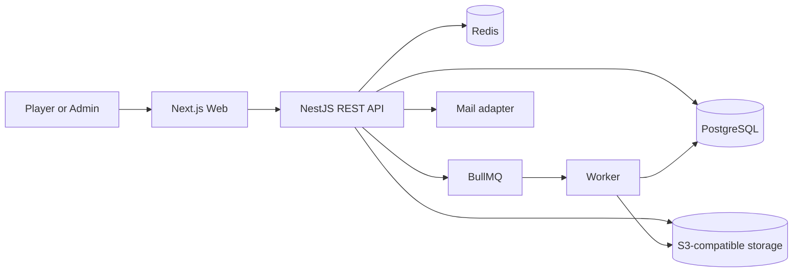

# Architecture

F7.2 adds `@arena-core/admin-operations` for append-only audit, safe cross-context search/timeline
projections and notification-only support delegation. Prisma remains in its infrastructure adapter.

## Match Finance boundary

`@arena-core/match-finance` owns entry requirements, participant reservations, match-specific
escrow, pre-start refunds, release state, and reconciliation. It consumes Wallet through a ledger
port and Matches integrates through an eligibility coordinator. No worker is added; final
distribution remains a future boundary.

## F4.3 result boundary

Start, submission comparison, final result and limited admin conflict resolution remain inside
`@arena-core/matches`. Submission history and final Result are separate concepts. Future Dispute,
Evidence, Wallet and Rating boundaries may consume final results, but are not implemented here.

## Game catalog package

`@arena-core/game-catalog` is framework-neutral: domain policies and application services depend on
repository and transaction ports, while Prisma is an infrastructure adapter. The API supplies
NestJS controllers, permission authorization, DTO validation, caching, and safe error mapping.

## Identity application boundary

`@arena-core/identity` is framework-neutral: domain policies → application services → ports →
Node/Prisma adapters. `apps/api` supplies NestJS composition only. An explicit transaction port
keeps multi-write security operations atomic and unit-testable.

`@arena-core/email` is framework-neutral. It owns message contracts, localized templates, safe URL
construction, sender ports, and the SMTP adapter. The API owns Nest composition, transport
lifecycle, and identity dispatch; Web and Worker do not depend on the email package.

The F2.3 HTTP adapter owns DTO validation, cookie serialization/extraction, global default-deny
session authentication, public-route metadata, Origin/content-type enforcement, rate limiting,
request IDs, safe response mapping, and the message-dispatcher boundary. Controllers consume
application services only. Test adapters are injected through the dynamic module and never become
runtime persistence.

## Style

A modular monolith is the final MVP architecture. It keeps financial transactions local, simplifies deployment and debugging, and preserves an extraction path through explicit domain contracts.

## Containers



PostgreSQL is authoritative. Redis holds queues, short-lived locks, rate-limit counters, and disposable coordination state. Object storage holds private evidence; the database holds metadata and access policy.

## Proposed monorepo

```text
apps/
  web/                  # Next.js App Router
  api/                  # NestJS HTTP application
  worker/               # NestJS/BullMQ jobs
packages/
  contracts/            # API/domain event schemas
  database/             # Prisma schema, migrations, seed
  config/               # typed environment validation
  eslint-config/
  typescript-config/
  ui/                   # accessible shared components
  i18n/                 # translation catalogs and locale helpers
  observability/        # logging, tracing/metrics abstractions
docs/
  adr/
infra/
  docker/
  compose/
tests/
  e2e/
```

## API module layout

Each module owns `domain/`, `application/`, `infrastructure/`, and `presentation/`. Modules communicate through exported application services, commands/queries, or domain events. They may share identifiers and value objects, but may not write another module's tables.

Modules:

- Identity & Access
- Users & Profiles
- Game Catalog
- Matchmaking
- Matches & Results
- Disputes
- Wallet & Ledger
- Ratings & Reputation
- Tournaments
- Notifications
- Administration
- Audit
- Feature Flags & Settings

## Current application boundaries

- `apps/web`: Next.js App Router shell exposing only technical foundation and health routes. Its server config produces a deliberately small public projection.
- `apps/api`: NestJS HTTP process with a validated configurable prefix and CORS allowlist, plus only a liveness module.
- `apps/worker`: NestJS application context with no HTTP server, queue, or job processor. It waits on process shutdown signals without polling and bounds graceful close with a validated timeout.
- `packages/config`: framework-neutral Zod schemas and immutable app-specific config factories. Apps validate once before bootstrap and inject config instead of reading `process.env` throughout the codebase.
- `packages/contracts`: framework-neutral health types only.
- `packages/database`: server-only, framework-neutral Prisma/PostgreSQL client
  boundary with explicit lifecycle; it currently owns only the Identity
  persistence slice.

Web does not consume the database package. API and Worker own independent clients only when `DATABASE_ENABLED=true`; disabled mode creates no connection. A separate development-only Compose topology provides PostgreSQL, Redis, private MinIO storage, and Mailpit, but its runtime remains unverified by accepted owner decision.

## Consistency strategy

- Single PostgreSQL transactions for wallet locks, settlement, and authoritative match transitions.
- Optimistic version fields for aggregate updates.
- Unique constraints and idempotency records for replay protection.
- Transactional outbox for asynchronous notifications, ratings, and projections.
- Jobs are at-least-once; handlers must be idempotent.

## Game extensibility

Game, mode, platform, crossplay, and rule-set versions are data. Typed strategy interfaces handle behavior that cannot safely be expressed as data: scoring validation, result comparison, rating policy, and tournament format. Arbitrary admin-provided code is forbidden.

## Quality gates

Format, lint, strict type-check, unit tests, integration tests against PostgreSQL/Redis, API contract generation, migrations, production builds, dependency/security scan, and E2E smoke tests.

## Profile composition

The API `ProfileModule` composes framework-neutral `UserProfileService` with a use-case-oriented
repository. The Prisma adapter owns explicit profile/onboarding projections and never leaks Prisma
models. Authentication retains credentials, sessions, email identity, and tokens; Profile owns
private display/locale/timezone/country preferences. Onboarding is derived, not stored. Existing
global session, CSRF, error, and no-store boundaries apply to the Profile controller.

## Player Identity composition

`@arena-core/player-identity` separates platform claims from authentication and Game Catalog.
Framework-neutral user/admin services consume a use-case repository; the API composes the Prisma
adapter and private controllers. Catalog supplies claimable Game/GamePlatform identity but does
not select user primary accounts. No external platform integration exists.

# F4.1 matchmaking

`packages/matchmaking` is a framework-neutral bounded context with pure policy/compatibility code,
application services, repository and transaction ports, and a Prisma adapter. `apps/api` composes
it behind private controllers. No worker imports it in F4.1 and no queue, polling, Redis, BullMQ,
WebSocket, or external provider transport is introduced.

# F4.2 matches

`@arena-core/matches` is a framework-neutral bounded context behind repository/transaction ports
and a Prisma adapter. API-level orchestration calls match creation after an accepted proposal,
avoiding a circular dependency from matchmaking. Creation is two-step and recoverable; no startup
side effect, scheduler, worker import, queue, or external call exists. Immutable snapshots form
the boundary between mutable catalog/player identity and the future result domain.

# F4.4 evidence/dispute boundary

Evidence and disputes remain a submodule of `@arena-core/matches`: pure domain policies and
application services depend on a repository port, with Prisma and NestJS wiring at the edges.
Result revisions are transactionally coupled to dispute resolution. A future blob-storage adapter
and future settlement hooks are explicit extension boundaries and are not implemented.

## Non-monetary wallet boundary

`@arena-core/wallet` owns the ARENA_POINT wallet, double-entry transaction boundary,
repository port, Prisma adapter, reversal, and reconciliation. Its domain/application
code is framework-independent. Payment and future escrow remain separate bounded
contexts, and match lifecycle code has no wallet side effects.

Non-monetary match settlement lives in `@arena-core/match-finance`: framework-neutral
domain/application services use Prisma adapters for atomic settlement and balanced ledger
posting, while NestJS exposes only orchestration routes.

Rating is an independent `@arena-core/rating` domain/application package. Elo calculation,
eligibility, leaderboard, and reconciliation are framework-neutral; Prisma is confined to its
infrastructure adapter and NestJS only composes User/Public/Admin HTTP routes. Match finality
prevents result mutation after rating while rating remains independent from settlement.

## Notification and delivery outbox

`@arena-core/notifications` isolates private in-app/email notification creation, preferences,
safe templates and transactional outbox delivery. Domain operations remain authoritative and
notification failure is recoverable through idempotent replay. Delivery is synchronous and
explicit in F7.1; no queue, broker, polling worker, push or SMS infrastructure exists.

# Production platform foundation

Configuration and production platform concerns remain outside domain packages. The API platform
layer owns request context, structured logging, error normalization, security middleware,
health/readiness, diagnostics, metrics abstraction, and shutdown state. See ADR-0028.

# F9.4 integration boundary

The `0.1.0-rc.1` candidate keeps the modular-monolith boundaries unchanged. Cross-surface route,
journey, privacy, idempotency, and release-artifact contracts are gated by
`tests/product-integration.test.mjs`; live infrastructure validation is deferred to F10.
