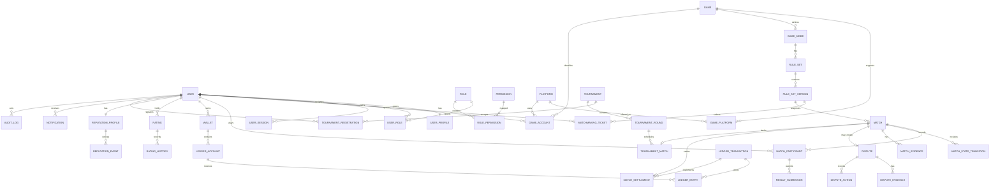

# Database Schema and Initial ERD

`admin_audit_events` is append-only: database triggers reject updates/deletes, metadata must be a
JSON object, and actor/target/action plus cursor-order indexes support investigations.

## F5.2 Match Finance

Migration `20260727180000_create_match_entry_reservations` extends ledger account/transaction
enums and creates `match_entry_reservations`. Composite participant ownership, one row per
Match/participant, idempotency, JSON snapshots, positive version, non-negative `ARENA_POINT`
amount, lifecycle timestamps, and lookup indexes are enforced. PostgreSQL runtime application
remains blocked when no server is available.

## F4.3 result persistence

Migration `20260726180000_create_match_results` extends Match timestamps/statuses and creates
`match_result_submissions` plus `match_results`. A partial unique index permits one ACTIVE
submission per participant. Composite foreign keys enforce participant ownership and result
membership. JSON-object, outcome, timestamp and positive-version checks defend integrity.

## Game catalog

Migration `20260725120000_create_game_catalog` adds games, shared platforms, game-platform
availability, game-specific crossplay groups and memberships, modes, and versioned rulesets.
Composite foreign keys prevent cross-game membership. Checks validate identifiers, capacities,
archive state, positive versions, and JSON objects. Partial unique indexes enforce one default
platform per game and one active default ruleset per game/mode. The identity migration is unchanged.

## Executable foundation

`packages/database/prisma/schema.prisma` is the executable database source of
truth. Its Identity models and `init_identity` migration are implemented; the
migration has not been applied because PostgreSQL is unavailable. The broader
ERD remains a design target rather than an applied schema.

Each domain phase translates only its approved aggregate boundary into Prisma
models, defines ownership and constraints, formats and validates the schema,
generates the client, creates a named migration, and reviews SQL before
application. Applied migrations are immutable.

Database names use lower snake case through explicit mappings where needed; Prisma types use singular PascalCase. Identifiers will use UUID/ULID-class opaque values, timestamps will be stored as UTC-capable PostgreSQL timestamps, and future money amounts will use signed 64-bit integer minor units with a separate currency code. Indexes will follow demonstrated query and constraint requirements rather than speculative indexing. A global soft-delete policy remains undecided and must not be introduced implicitly.

All identifiers are UUID/ULID-class opaque IDs. Timestamps are UTC. Monetary values are signed 64-bit integer minor units plus ISO-like currency code. Mutable aggregates have a version column. Sensitive identities use normalized hashes where uniqueness is needed without plaintext exposure.

## Additional required tables

`IdempotencyKey`, `OutboxMessage`, `RefreshTokenFamily`, `PasswordResetToken`, `EmailVerificationToken`, `GameModePlatform`, `CrossplayPolicy`, `MatchmakingPreference`, `DisputeAction`, `FeatureFlag`, and `SystemSetting`.

## Critical constraints

- Unique active session token hashes and refresh-family identifiers.
- Unique game slug and platform slug.
- Unique `(user_id, game_id, platform_id, normalized_external_id_hash)`.
- Unique active matchmaking ticket per user/game-mode scope.
- Unique participant seat per match and unique user per match.
- Unique settlement per match.
- Unique `(idempotency_scope, idempotency_key)`.
- Ledger transaction sum of debits/credits equals zero, enforced in service transaction and verified by reconciliation.
- Published `RuleSetVersion` rows cannot be updated.

Non-Identity product models remain deferred to their owning implementation phases.

## Implemented Identity schema

The executable Prisma schema maps eleven models to `users`, `user_profiles`,
`user_emails`, `password_credentials`, `user_sessions`,
`email_verification_tokens`, `password_reset_tokens`, `roles`, `permissions`,
`user_roles`, and `role_permissions`.

Standalone keys are database-generated UUIDs; join tables use composite keys.
SQL identifiers are explicitly snake_case and timestamps are UTC
`TIMESTAMPTZ(3)` values. Enums are `user_status` and `session_status`.

Indexes cover account state, normalized email, profile ownership, session/token
lookup and cleanup, authorization keys, and assignments. The partial unique
index `user_emails_one_primary_per_user_key` enforces one primary email per
user.

Migration-level checks enforce non-negative counters/security versions,
lowercase non-empty normalized email, non-empty keys/hashes, locale/country
shape, temporal ordering, revocation consistency, assignment expiry, and
soft-delete consistency. Prisma Schema cannot express these checks or the
partial index directly.

Owned rows cascade only on exceptional physical erasure. Authorization catalog
references restrict deletion; `assigned_by_user_id` uses `SET NULL`.
Application deletion remains soft. The earlier ERD is a roadmap; only these
Identity tables are executable.

F2.5 uses the existing `UserProfile` relation through explicit Prisma projections and a `userId`
upsert. Onboarding is derived from user status, primary-email verification, and profile fields.
The schema is sufficient; F2.5 adds no field and no migration.

## Player Identity tables

Migration `20260725203000_create_user_game_accounts` adds `user_game_accounts` and
`game_account_reviews`, conservative status/verification/action enums, restrictive User/Game
foreign keys, and a composite GamePlatform/Game foreign key. Partial unique indexes enforce one
primary per user/game, one active account per user/GamePlatform, and one active normalized handle
claim per GamePlatform. Check constraints enforce primary/verified and status timestamps. Runtime
application is blocked until PostgreSQL is available; static schema verification is automated.

# F4.1 matchmaking persistence

The `MatchmakingRequest` and `MatchmakingProposal` tables preserve account and catalog
consistency through composite foreign keys. Partial unique indexes enforce one active request per
user and one active canonical pair. Check constraints cover canonical pairs, TTL ordering,
priority/version bounds, and status-dependent timestamps. A PostgreSQL trigger with sorted
transaction advisory locks prevents a request appearing in either side of two pending proposals.
These SQL guarantees require real PostgreSQL runtime verification; static migration tests are not
runtime proof.

# F4.2 match persistence

`matches`, `match_participants`, and `match_audit_events` are introduced by
`20260726120000_create_matches`. A unique proposal FK enforces one match per accepted intent;
participant uniqueness enforces one user and one side per match. Composite account/platform FKs
preserve ownership and game consistency. JSON object/schema-version checks, ready-deadline,
version, and status/timestamp checks protect snapshots and lifecycle. Indexes cover user history,
admin/catalog history, ready expiry, and audit lookup. Runtime application is blocked without
PostgreSQL.

# F4.4 migration

`20260726220000_create_match_evidence_and_disputes` adds evidence, disputes, responses, result
revisions, their enums, audit actions, JSON/timestamp/version checks, participant ownership foreign
keys, response/revision uniqueness, deadline indexes, and a partial unique index for one active
dispute per match. No file/storage, wallet, rating, or notification table is introduced. Static SQL
verification is covered by tests; runtime application is blocked while PostgreSQL is unavailable.

## F5.1 wallet ledger

Migration `20260727100000_create_wallet_ledger` adds `wallets`, `ledger_accounts`,
`ledger_transactions`, `ledger_entries`, and `wallet_audit_events`, plus their status,
account-type, transaction-type, direction, and audit-action enums. Constraints enforce
ARENA_POINT, positive BIGINT entries, user/system account shape, nonnegative user
projections, unique operation keys, one available account, linked reversal, and
deterministic entry sequence. Deferred balance checks and immutable-entry triggers guard
the ledger. PostgreSQL runtime application remains blocked when no database is available.

`match_settlements` has one row per match and binds the final result/dispute revision and
ledger transaction. Constraints enforce ARENA_POINT, accounting equality, zero retention,
terminal timestamps, and winner/type consistency. Reservations reference their settlement.

`player_ratings`, `player_rating_changes`, and `match_rating_applications` implement F6.1.
Constraints enforce integer bounds, statistics equality, immutable change arithmetic, JSON object
snapshots, unique scope, one match/user change, and unique match/result/idempotency application.
The leaderboard composite index exactly follows rating, matches, wins, update time, and ID order.

## Notifications

The notification migration adds versioned notification, preference, per-channel outbox and
append-only attempt tables. Unique constraints cover notification deduplication, user/type
preferences, notification/channel delivery and attempt sequence. Checks bound locale, schema
version, attempts and claim consistency. No queue, push, SMS or webhook table is introduced.
