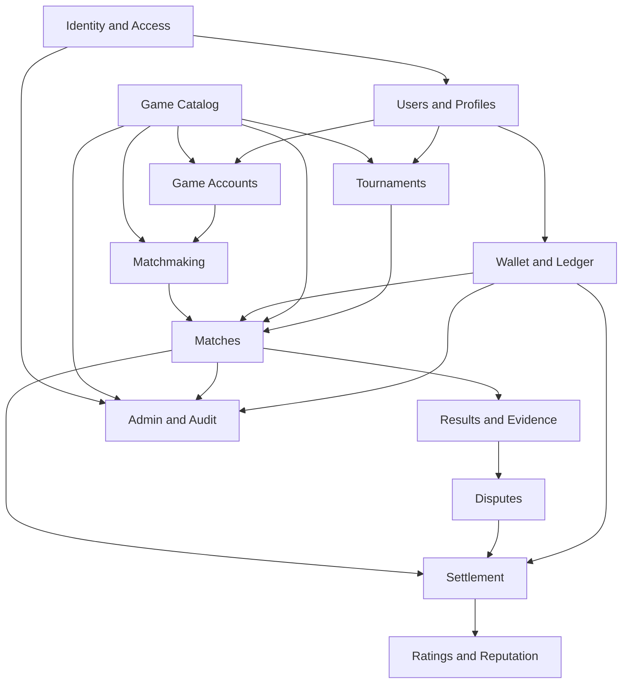

# Domain Model

Administrative operations owns generic audit events and safe read projections, but does not own
identity, match, wallet, rating or notification state.

## Match Finance

`MatchEntryReservation` snapshots the server-derived `ARENA_POINT` requirement for one Match
participant. Required entries move from user available balance into match-specific escrow.
`RESERVED` satisfies Ready; start creates `RELEASED` without ledger movement. `REFUNDED` preserves
a separate pre-start ledger history. Final distribution is outside F5.2.

## F4.3 Match results

`MatchResultSubmission` is append-only participant history; replacement creates a new record and
supersedes the prior one. `MatchResult` is unique per Match and represents confirmation, conflict,
or audited admin resolution. Final scores derive winner/loser or draw; conflict stores no winner.

## Game catalog boundary

`Game` is the catalog root. `Platform` is shared; `GamePlatform` describes availability.
`CrossplayGroup` is game-specific and references game-platform rows. `GameMode` owns participant and
team bounds. `GameRuleset` is a positive, per-key version attached to a mode: drafts are editable
and published versions are immutable. User game accounts, matchmaking, wallet, queues, and vendor
APIs are outside this boundary.

## Identity behavior

Registration atomically creates a pending user, primary unverified email, credential, and single-use
verification token. Primary-email verification activates the pending user. Password login is
active-only. Reset consumes its token, changes the credential, increments `securityVersion`, and
revokes sessions atomically. Session validation rejects expiry, revocation, inactive/deleted users,
and stale security versions.

## Bounded contexts and dependencies

## Aggregate ownership

| Context      | Aggregate roots                 | Key invariants                                                        |
| ------------ | ------------------------------- | --------------------------------------------------------------------- |
| Identity     | User, Session, Role             | revoked sessions cannot refresh; permissions enforced server-side     |
| Profiles     | UserProfile, GameAccount        | one normalized account identifier per game/platform scope             |
| Game Catalog | Game, GameMode, RuleSetVersion  | published rule versions are immutable                                 |
| Matchmaking  | MatchmakingTicket               | one active ticket per compatible scope/user                           |
| Matches      | Match                           | transitions follow state machine; participants fixed after acceptance |
| Results      | ResultSubmission, MatchEvidence | one current submission per participant; private evidence              |
| Disputes     | Dispute                         | only authorized reviewers resolve; every action audited               |
| Wallet       | Wallet, LedgerTransaction       | entries balance to zero; balances never use floating point            |
| Settlement   | MatchSettlement                 | at most one terminal settlement per match                             |
| Ratings      | Rating, ReputationProfile       | event-derived history retained                                        |
| Tournaments  | Tournament                      | capacity and bracket format fixed after start                         |

## Boundary rules

- Wallet exposes commands such as `lockFunds`, `releaseFunds`, and `settleMatch`; Match never edits ledger rows.
- Match consumes immutable rule-set snapshots, not mutable live rules.
- Results propose an outcome; Match owns authoritative outcome/state.
- Disputes resolve a contested outcome; Settlement consumes the final outcome.
- Ratings update after a committed settlement event, never before.

## Implemented Identity bounded context

`User` is the Identity aggregate root and owns account status, soft deletion,
security version, and authentication timestamps. It contains no email,
password, balance, rating, or game data.

- `UserProfile` is optional public-profile metadata.
- `UserEmail` supports multiple identities and at most one primary email.
- `PasswordCredential` stores only a hash and algorithm label.
- `UserSession` is server-side, expiring, hash-addressed, and revocable.
- Verification belongs to an email; password reset belongs to a user.
- Flat roles and permissions use explicit assignment tables.

States are `PENDING_VERIFICATION`, `ACTIVE`, `SUSPENDED`, `DISABLED`, and
soft-deleted `DELETED`. Suspension is potentially temporary enforcement;
disabled is administrative/security deactivation. Runtime transitions remain
outside F2.1.

Database and future application validation jointly enforce non-negative
counters, temporal ordering, revocation/deletion consistency, unique hashes,
and one primary email per user. Registration, login, hashing, guards,
middleware, seeds, and endpoints are not implemented.

## Private profile and identity onboarding

`UserProfile` is private preference metadata inside Identity but separate from credentials and
sessions. It owns display name, locale, IANA timezone, and optional country. Onboarding is the
ordered derived projection `VERIFY_EMAIL`, `COMPLETE_PROFILE`, `SET_TIMEZONE`; completion requires
an active user, verified primary email, valid profile, and valid timezone. It creates no role,
wallet, game account, email, or session and grants no later-domain authorization.

## Player Identity

`UserGameAccount` connects one User to one Game and a GamePlatform belonging to that Game. Users
may hold cross-platform accounts but only one active claim per GamePlatform. Status transitions
cover pending, verified, rejected, suspended, and disconnected; only verified rows may be primary,
at most one per user/game. `GameAccountReview` preserves append-only admin verification history.

# F4.1 matchmaking boundary

`MatchmakingRequest` records one user's verified game-account selection plus the authoritative
game, mode, active ruleset, platform, and crossplay group. Active states are `PENDING`,
`SEARCHING`, and `PROPOSED`; terminal outcomes are `MATCHED`, `CANCELLED`, `EXPIRED`, and `FAILED`.
Only one active request is permitted per user.

`MatchmakingProposal` joins exactly two canonically ordered requests. It is temporary and can be
`PENDING`, `ACCEPTED`, `REJECTED`, `EXPIRED`, or `CANCELLED`. Both users accepting marks their
requests `MATCHED`; it does not create a Match entity. Reject/expiry restores an unexpired request
to `SEARCHING`. Both aggregates use optimistic versions.

# F4.2 match boundary

`Match` is created only from one accepted `MatchmakingProposal` and owns exactly two
`MatchParticipant` rows (`SIDE_A`, `SIDE_B`). Catalog and participant identity labels are
immutable versioned snapshots. The usable lifecycle is `CREATED → AWAITING_READY → READY`, with
pre-ready `CANCELLED`, deadline `EXPIRED`, and audited `VOIDED` exits. Result, score, winner,
evidence, dispute, and finance remain a future bounded context.

# F4.4 evidence and arbitration

`MatchEvidence` belongs to a match participant and moves from `ACTIVE` to either `WITHDRAWN` or
`LOCKED`. `MatchDispute` snapshots the bounded result state and owns one append-only
`MatchDisputeResponse`. At most one active dispute exists per match. An assigned reviewer moves an
eligible dispute into review and writes a terminal resolution. `MatchResultRevision` preserves the
previous and corrected/void payload before result mutation. Arbitration does not perform payment,
rating, notification, or automatic game verification.

## Wallet and ledger

A user has at most one lazily-created Wallet and one `USER_AVAILABLE` account for
ARENA_POINT. `SYSTEM_ISSUANCE` and `SYSTEM_ADJUSTMENT` are userless counterparts.
LedgerTransaction groups balanced immutable LedgerEntries; a linked reversal is the only
correction mechanism. Reconciliation compares the cached account projection to the
signed sum of entries without changing either value.

`MatchSettlement` is the immutable terminal accounting record for a match. Its type is
winner-takes-all, draw refund, or void refund. Reservation outcomes distinguish winner
credit, loser contribution, draw refund, and void refund.

`PlayerRating` is the current aggregate for a user/game/mode/crossplay-group and immutable policy
version. `PlayerRatingChange` records one participant's before/after Elo calculation per match.
`MatchRatingApplication` is the unique idempotent two-participant application boundary. Rating
history is replayed for reconciliation; it is never silently updated.

## Notification model

`Notification` is the immutable user-visible message plus mutable read/archive timestamps.
`NotificationPreference` is a lazy per-user/type override. `NotificationOutboxMessage` is
unique per notification/channel and carries an immutable safe payload snapshot.
`NotificationDeliveryAttempt` is append-only and unique by outbox message and attempt number.
