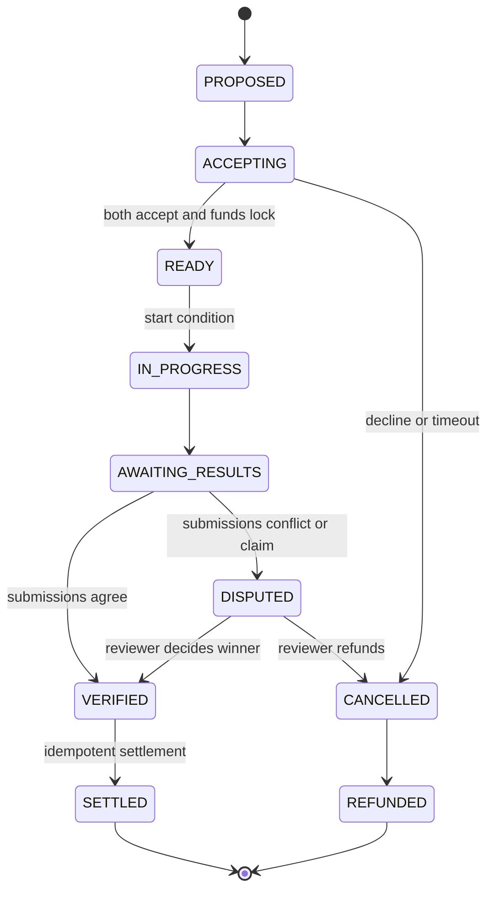

# Match Lifecycle

Every transition records actor, reason, prior/new state, request/correlation ID, and timestamp. A transition and its financial side effect commit atomically where both are authoritative. Terminal states reject further mutation except audited administrative correction through a compensating transaction.

Timeout jobs carry the expected state/version so stale jobs become no-ops. `SETTLED` and `REFUNDED` are mutually exclusive.
